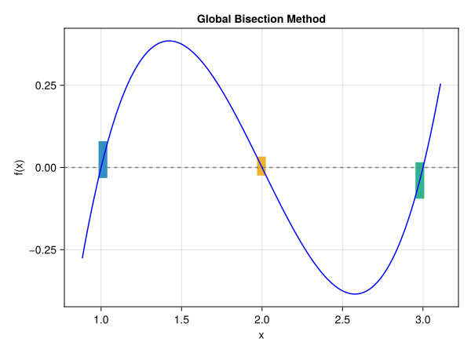

```@meta
CurrentModule = IntervalArithmeticPlayground
```

# IntervalArithmeticPlayground

Documentation for [IntervalArithmeticPlayground](https://github.com/Totti95U/interval-arithmetic-playground).

```@index
```

## Root Finding

[`rootfinding_with_bisection`](@ref) は二分法を用いて与えられた関数の根を求める関数です。
根が存在する区間の候補のリストを返します。

```@example
using IntervalArithmetic, IntervalArithmeticPlayground

f(x) = (x - 1) * (x - 2) * (x - 3)

rootfinding_with_bisection(f, interval(0, 3.5), maxiter=6)
```

`src/example/rootfinding.jl` にある `plot_roots` 関数を使うことで次のような図を描くこともできます。


